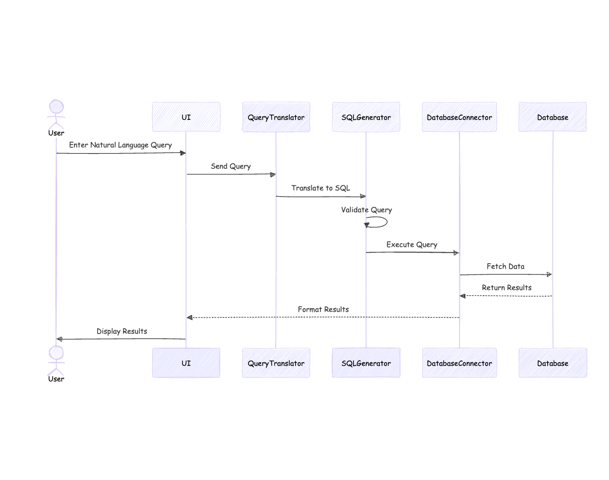

# Query Genie: Natural Language Database Querying

## Overview
Query Genie is an innovative platform that democratizes database access by allowing non-technical users to query databases using natural language.

## Key Features
- 🚀 Natural Language to SQL Translation
- 🔒 Secure Database Access
- 🤖 AI-Powered Query Generation
- 📊 Intuitive User Interface

## Architecture

### High-Level Architecture


The high-level architecture demonstrates the core flow:
1. User inputs natural language query
2. Query is translated to SQL
3. Database is queried
4. Results are returned and formatted

### Low-Level Component Architecture


Key components include:
- Frontend: React/Next.js UI
- Backend: Express.js Server
- AI Integration: OpenAI LLM Service
- Database Connector
- Query Validation Service

### System Sequence Diagram


Illustrates the detailed interaction between system components during a typical query process.

## Technical Stack
- **Frontend**: React, Next.js
- **Backend**: Node.js, Express.js
- **Database**: MongoDB
- **AI Integration**: OpenAI LLMs
- **Authentication**: Custom secure access control

## Installation

```bash
# Clone the repository
git clone https://github.com/your-org/query-genie.git

# Install dependencies
cd query-genie
npm install

# Set up environment variables
cp .env.example .env
# Fill in your configuration

# Run the application
npm run dev
```

## Configuration
Ensure to set the following environment variables:
- `OPENAI_API_KEY`: Your OpenAI API key
- `DATABASE_CONNECTION_STRING`: Database connection details
- `AUTH_SECRET`: Authentication secret

## Future Roadmap
- [ ] Multi-database support
- [ ] Advanced data visualization
- [ ] Voice query capabilities
- [ ] Continuous learning mechanism

## Contributing
1. Fork the repository
2. Create your feature branch (`git checkout -b feature/AmazingFeature`)
3. Commit your changes (`git commit -m 'Add some AmazingFeature'`)
4. Push to the branch (`git push origin feature/AmazingFeature`)
5. Open a Pull Request


## Contact
Your Name - anuraagramineni456@gmail.com

Project Link: [https://devpost.com/software/techchat)
